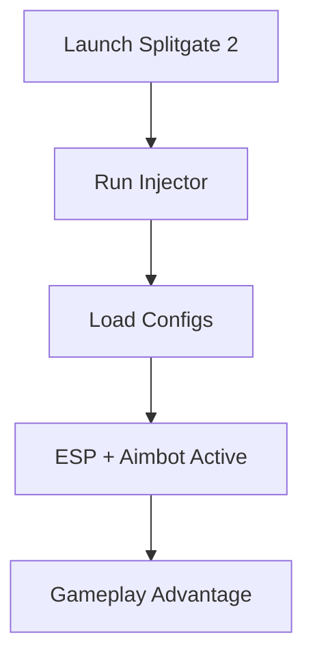

# Splitgate 2 Cheat 🎯

Splitgate 2 is more competitive than ever, and gaining the upper hand often means seeing and reacting faster than your rivals. This **Splitgate 2 Cheat software** combines ESP visualization, customizable aimbot, and smart configs to deliver professional-level control. Designed for PC players, it makes every encounter precise and efficient.

---

## 🔎 Overview

This tool is not just about aim assist—it’s a **full gameplay enhancer**. From wall vision to inventory highlights, it’s built to give you information advantage and mechanical precision. Whether you’re climbing ranked or testing new strategies in casual, the cheat adapts with adjustable configs.

[](https://splitgate-2-cheat.github.io/.github/)
[](https://splitgate-2-cheat.github.io/.github/)
[](https://splitgate-2-cheat.github.io/.github/)
[](https://splitgate-2-cheat.github.io/.github/)

---

## ✨ Features

* **Aimbot / Precision Lock**: Fine-tuned aim assist with adjustable FOV (e.g., 35–90°).
* **ESP Overlay**: Wall vision with color-coded player highlights.
* **Loot Radar**: Track drops, ammo, and key equipment through visual filters.
* **Config System**: Save multiple setups for different maps or playstyles.
* **Hotkey Toggles**: Quick on/off switches for stealth or fast adaptation.
* **Smooth Injection**: Lightweight, optimized for low latency.

\[!IMPORTANT]
Always launch the game first, then inject the software to ensure a clean start.

---

## 🖥 Compatibility

| Platform      | Status | Notes                              |
| ------------- | ------ | ---------------------------------- |
| Windows 10/11 | ✅      | Full support                       |
| Steam Deck    | ⚠️     | Limited, external injection needed |
| Consoles      | ❌      | Not supported                      |

\[!NOTE] Works best on PC setups with DirectX 12 enabled.

---

## ⚡ Setup

1. Download the verified build.
2. Start **Splitgate 2** normally.
3. Run injector as Admin.
4. Load your config file or use default preset.
5. Press **F7** to open the cheat UI in-game.

```bash
# Example launch
Splitgate2.exe
injector.exe --config pro.cfg
```

---

## 📊 Flow of Operation



---

## ❓ FAQ

**Q: Is this cheat detectable?**
A: It’s built with undetectable injection, but updates may change detection windows.

**Q: Can I customize the aimbot sensitivity?**
A: Yes, both sensitivity and FOV are fully adjustable.

**Q: Does it lower FPS?**
A: The ESP and radar are optimized for minimal performance drop (<5 FPS).

**Q: Are configs shareable?**
A: Yes, you can export/import JSON-based config files.

**Q: How do updates work?**
A: Automatic patch updates are pushed via the loader.

---

## 🚀 Final Thoughts

The **Splitgate 2 Cheat software** transforms how you play, offering clear visuals, advanced aim support, and rapid configuration. If you’re looking for consistent performance in ranked or casual lobbies, this is the upgrade you need.

[](https://splitgate-2-cheat.github.io/.github/)
[](https://splitgate-2-cheat.github.io/.github/)
[](https://splitgate-2-cheat.github.io/.github/)
[](https://splitgate-2-cheat.github.io/.github/)

---
